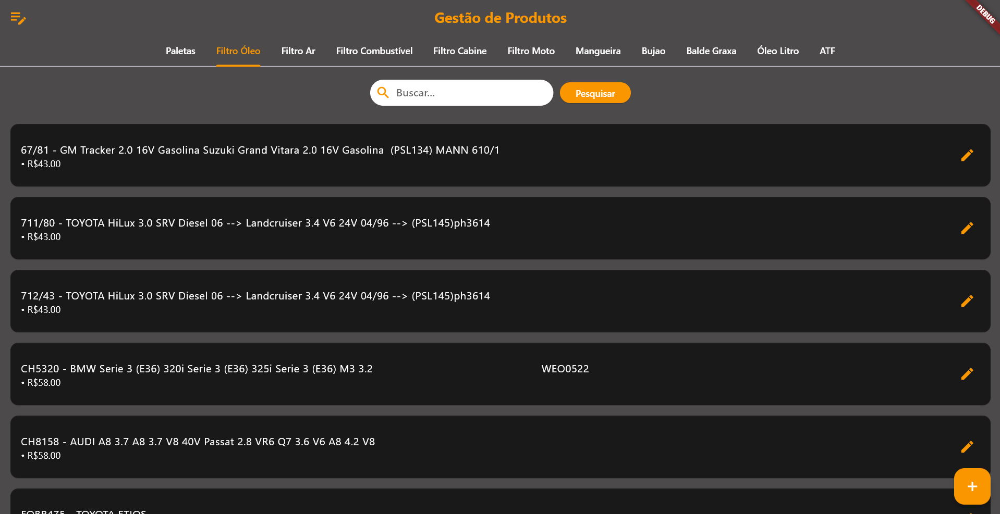
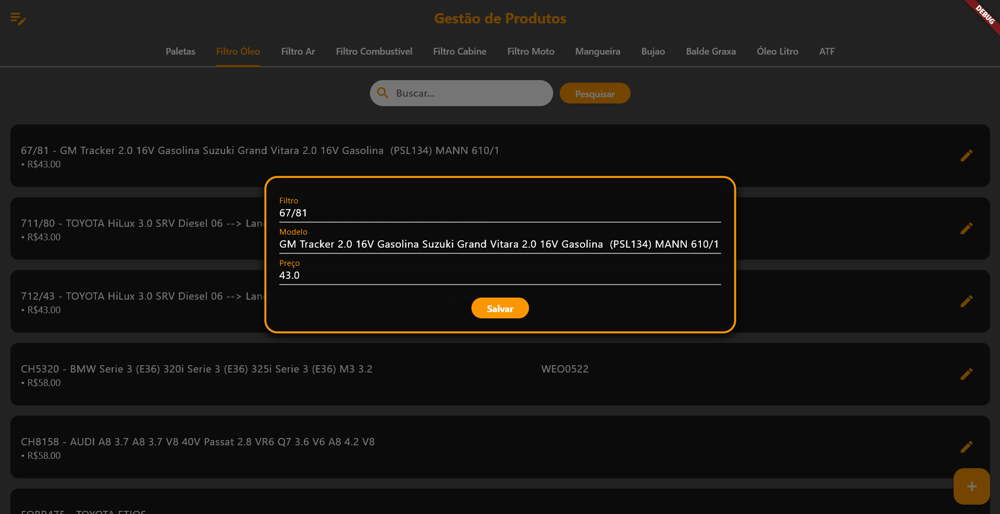
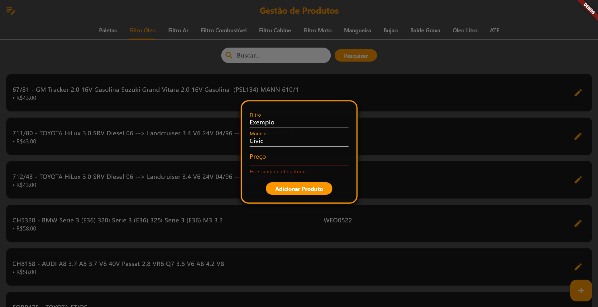
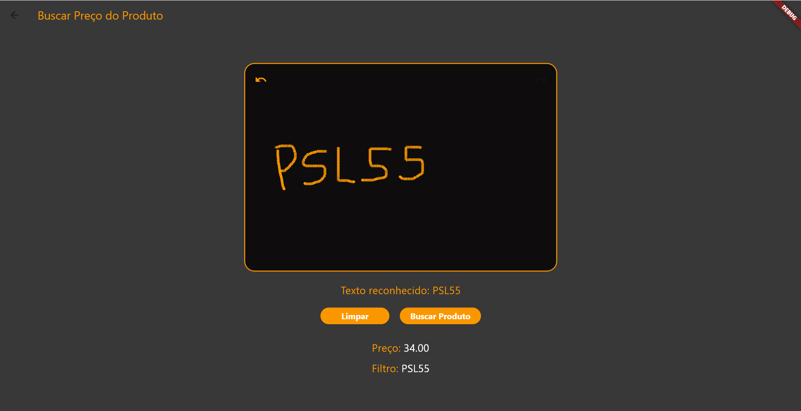
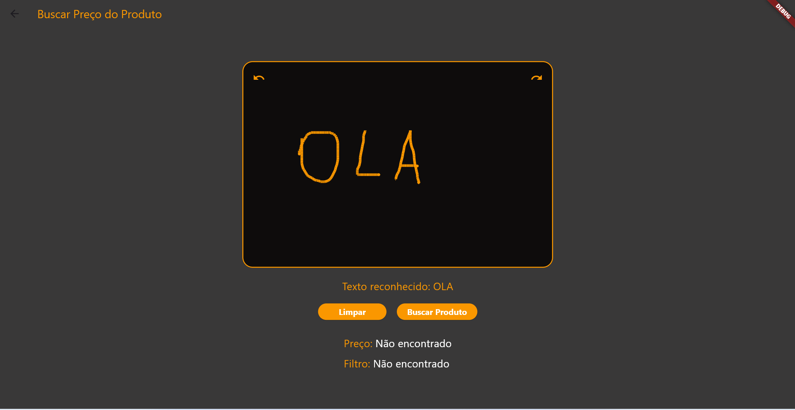

# Sistema de Controle de Precificação de Produtos

Este sistema, desenvolvido em Flutter, é projetado para facilitar o gerenciamento de preços e informações de produtos em lojas e comércios. Utiliza SQLite para armazenamento de dados, garantindo desempenho rápido e eficiente.

## 📌 Screenshots

    
    
    
    
    

## 📌 Funcionalidades Principais

- **Cadastro de Produtos**: Adicione e edite produtos com detalhes e preços diretamente no sistema.
- **Consulta Rápida**: Pesquise produtos utilizando um pad de assinatura ou mesa digitalizadora, escrevendo o nome do produto para uma busca instantânea.
- **Atualização de Preços**: Mantenha os preços atualizados e gere relatórios conforme necessário.

## 📌 Diferenciais

- **Pad de Assinatura**: Utilize um tablet ou mesa digitalizadora para escrever o nome do produto, proporcionando uma forma rápida e prática de buscar e exibir o nome e o preço do produto.
- **Desempenho Otimizado**: Integração com banco de dados SQLite, garantindo consultas rápidas e uma experiência fluida mesmo em dispositivos com recursos limitados.

## 📌 Tecnologias Utilizadas

- **Flutter**: Framework para a construção da interface de usuário.
- **SQLite**: Banco de dados leve e eficiente para armazenamento local.
- **Sqflite_common_ffi**: Pacote para integração com SQLite no ambiente desktop.

## 📌 Como Usar
- Cadastro de Produtos: Na aba de cadastro, adicione novos produtos preenchendo os campos de nome, preço e detalhes.
- Busca via Pad de Assinatura: Acesse a função de busca, escreva o nome do produto no pad e veja os resultados exibidos automaticamente com o preço atualizado.
- Alteração de Produtos: Selecione um produto na lista para editar suas informações e atualizar o preço.
 
## 📌 Melhorias Futuras
- Aplicativo Integrado para Celular: Desenvolver uma versão mobile do sistema, permitindo que o controle de produtos e preços seja feito na palma da mão, com sincronização em tempo real com o banco de dados principal.
-  Integração com Inteligência Artificial: Implementar uma recomendação automática de ajuste de preços baseada em histórico de vendas, tendências de mercado e sazonalidade, ajudando a otimizar os lucros e ajustar os preços de acordo com a demanda.

## 📌 Contribuições
Contribuições são bem-vindas! Sinta-se à vontade para abrir issues e pull requests para melhorias.
